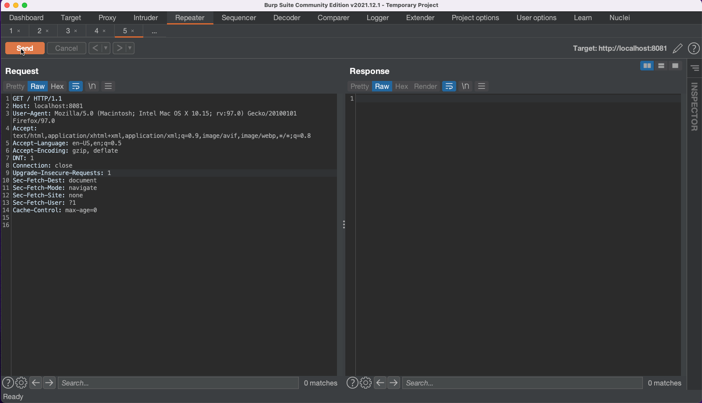
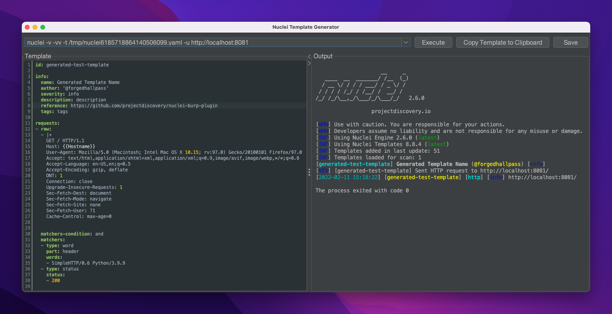
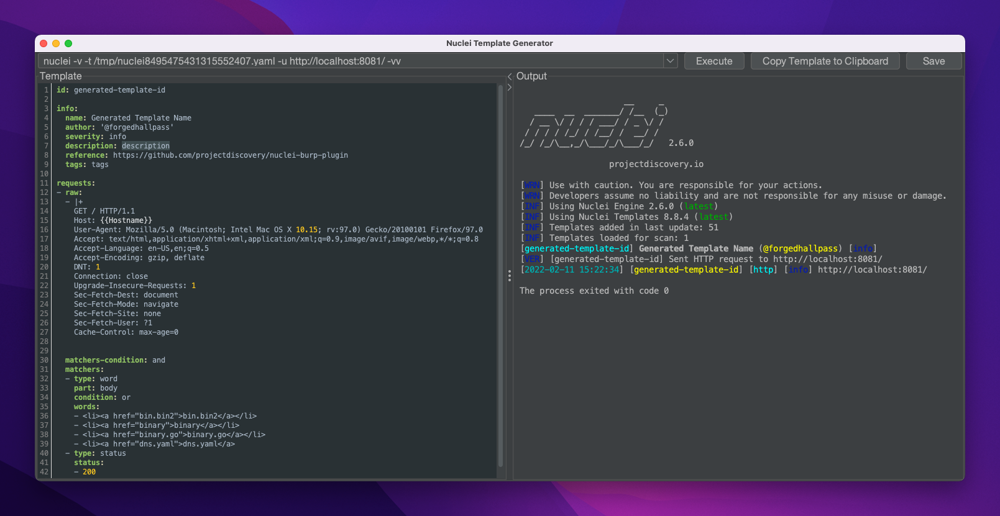
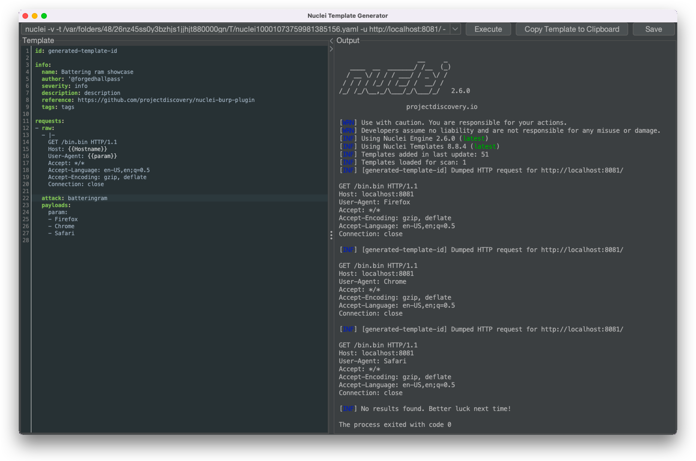

<h1 align="center">
   
  
</h1>

<h4 align="center">Nuclei Template Generator Burp Plugin</h4>

  
  

A `BurpSuite` plugin intended to help with [`nuclei`](https://github.com/projectdiscovery/nuclei) template generation.

   
  

## Features

### Template matcher generation

* `Word` and `Binary` matcher creation using selected response snippets from `Proxy` history or `Repeater` contexts
* Multi-line selections are split to separate words for readability
* Binary matchers are created for selections containing non-`ASCII` characters
* The `part` field is auto-set based on whether the selection was in the request header or body
* Every generated template auto-includes a Status matcher, using the `HTTP` status code of the response

### Request template generation

* In the `Intruder` tab, selected payload positions can be used to generate request templates, using one of the following attack types: `Battering ram`, `Pitchfork` or `Cluster bomb`
* The selected text snippet from an `HTTP` request under the `Proxy` or `Repeater` tab can be used to generate a request template with the attack type defaulting to `Battering ram`

### Template execution

* Generated templates can be executed instantly, and the output is shown in the same window for convenience
* The plugin auto-generates the CLI command, using the absolute nuclei path, absolute template path and target information extracted from the desired request
* History of unique, executed commands are stored, can be quick searched and re-executed within the current session

### Experimental features

* (Non-contextual) `YAML` property and value **auto-complete**, using reserved words from the nuclei [`JSON` schema](https://github.com/projectdiscovery/nuclei/blob/master/nuclei-jsonschema.json)
* **Syntax highlighting** of `YAML` properties, based on reserved words

### Productivity

* Almost every action can be triggered using keyboard shortcuts:
    * **F1**: open nuclei template documentation
    * **Ctrl + Enter**: execute current template
    * **Ctrl + Shift + E**: jump to the template editor
    * **Ctrl + L**: jump to the CLI input field
    * **Ctrl + S**: save the current template
    * **Ctrl + Plus/Minus**: increase/decrease font size
    * **Ctrl + Q**: quit
* The template path is auto-updated if the template is saved to a new location
* The `template-id` is recommended as file name when saving

### Settings

* The plugin attempts to auto-detect and complete the configuration values
* The code searches for the nuclei binary path, using the values from the process's environmental `PATH` variable.  
  **Note**: the BurpSuite binary, opposed to the stand-alone BurpSuite jar, might not have access to
  the current users's `PATH` variable.
* The target template path is calculated based on the default nuclei template directory, configured under `<USER_HOME>/.config/nuclei/.templates-config.json`
* The name of the currently logged-in operating system user is used as a default value for the template author configuration

### Look and feel

* The template generator window supports Dark and Light themes. The presented theme is chosen based on the selected BurpSuite theme, under `User Options`
* Support for **colored** nuclei output
* Modifiable font size in the template editor and command output

## Building the code

Use `mvn clean package -DskipTests` to build the project yourself. It requires Maven `3.x` and Java `11+`.

Alternatively, different builds can be downloaded from the [Actions](https://github.com/projectdiscovery/nuclei-burp-plugin/actions) section. The built artifact can be found under the latest build's 'Artifacts'
section. These artifacts are generated after every commit, and are stored for 3 days only, but they can be re-generated by manually triggering a workflow.

## Installation

1. Build the code yourself or download a pre-built/[release](https://github.com/projectdiscovery/nuclei-burp-plugin/releases) version
2. Go to `Extender` in BurpSuite
3. Click the `Add` button in the `Extensions` tab
4. Leave the `Extension Type` on `Java`
5. Select the path to the plugin (`.jar`)

## Screenshots

### Credits

Created with ❤️ by [@forgedhallpass](https://github.com/forgedhallpass)

### License

Nuclei and this plugin are distributed under [MIT License](LICENSE).

<h1 align="left">
   
</h1>